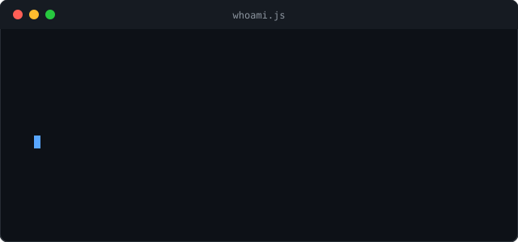
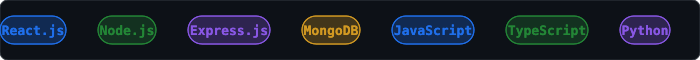

  

  

  

  
  
  

  
  
  
  

  

  

👆 a small code editor I built by hand for this profile — watch it type live on GitHub

  

 

## 🚀 About Me

> I'm a final-year BCA student (2023–2026) at ITM SLS Baroda University, based in Surat, India. I build full-stack web applications with the MERN stack and integrate AI into real, working products — not just tutorials.
>
> Alongside my degree, I freelance independently on Fiverr, taking on real client work and learning to ship on someone else's deadline, not just my own. Right now I'm in the middle of a transition: moving from pure web development into AI and machine learning, one Python script at a time.

 

  

## 📖 My Journey

<table>
<tr><td width="90"><b>2023</b></td><td>The Start — began BCA with zero coding background, just curiosity. First lines of code, first "why isn't this working" nights.</td></tr>
<tr><td><b>2024</b></td><td>Foundations — learned JavaScript, then React, Node.js, Express, and MongoDB, building small projects to actually understand the stack.</td></tr>
<tr><td><b>2025</b></td><td>Shipping Real Things — built and deployed <b>UrbanNest</b>, a full hostel booking platform. Competed in a 24-hour hackathon plus a few other coding events.</td></tr>
<tr><td><b>2025</b></td><td>Going Independent — started freelancing on Fiverr as an independent developer, taking on real client work.</td></tr>
<tr><td><b>2026</b></td><td>AI Era — built <b>NutriVision</b> (AI food analyzer, Gemini Vision API). Enrolled in a structured AI/ML developer program.</td></tr>
<tr><td><b>Now</b></td><td>Final year of BCA, actively looking for an internship or first full-time role, while continuing to freelance and build in public.</td></tr>
</table>

  

## 🤖 Currently Learning — AI / Machine Learning

  

> Enrolled in a full AI/ML developer institute program (~16–18 months), studying in parallel while applying for data analysis internships.

  

## 📌 Featured Projects

<table>
<tr><th>Project</th><th>Description</th><th>Stack</th></tr>
<tr>
<td><a href="https://github.com/PalAnghan/Nutrivision-AI-Food-Nutrition-Analyzer"><b>NutriVision</b></a></td>
<td>AI food analyzer — analyzes food photos via the Gemini Vision API, returns calories, protein, health score, and age-based recommendations</td>
<td>  </td>
</tr>
<tr>
<td><a href="https://github.com/PalAnghan/hostel-website"><b>UrbanNest</b></a></td>
<td>Deployed full-stack hostel booking platform — my first project real users could actually open and use</td>
<td>   </td>
</tr>
<tr>
<td><a href="https://github.com/PalAnghan/internship-project-management-portal"><b>Internship & Project Management Portal</b></a></td>
<td>Final-year project — a portal to manage internships and student project workflows</td>
<td>  </td>
</tr>
<tr>
<td><a href="https://github.com/PalAnghan/career-bot"><b>Career-Bot</b></a></td>
<td>Career guidance / automation bot</td>
<td></td>
</tr>
</table>

<b>Other repos:</b> <code>job-tracker-mern</code> · <code>kawaii-marksheet-app</code> · <code>morning-buddy-pro</code> · <code>weather-app</code> · <code>clock.com</code> · <code>neet-practice-app</code> · <code>rudrabyte-frontend-internship-2025</code> · <code>AI-ML-Red-White-ExtraClass</code> · <code>AI-ML-RedandWhite</code> · <code>Python-Fundamental-Booster-Red-White</code> · <code>Logic-Box-Red-and-White-Python</code> · <code>C-Language</code>

  

## 🎮 Fun Zone

  

  

  

  
  
  

